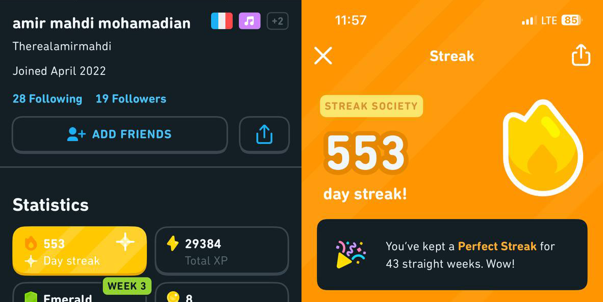
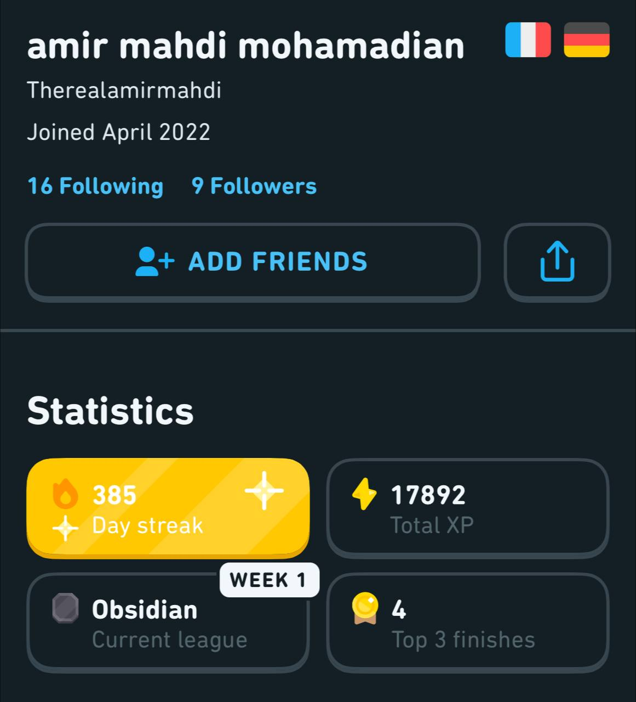
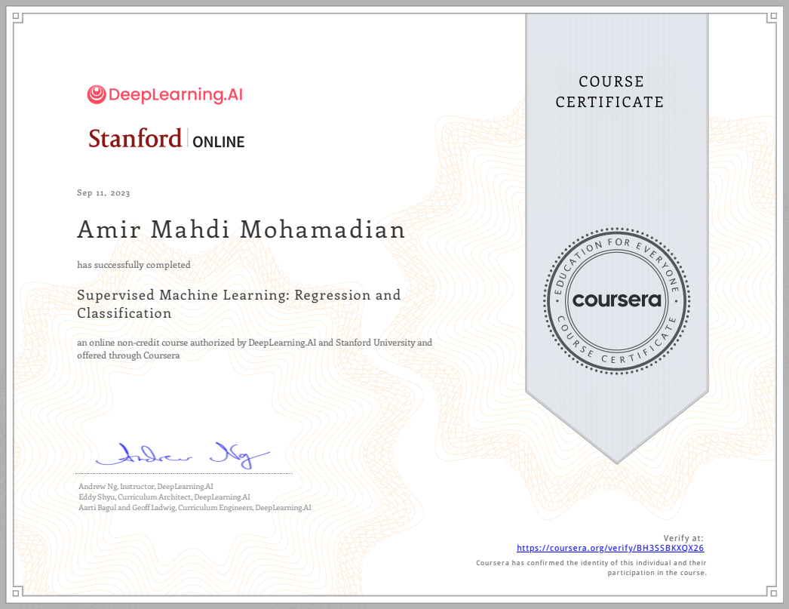
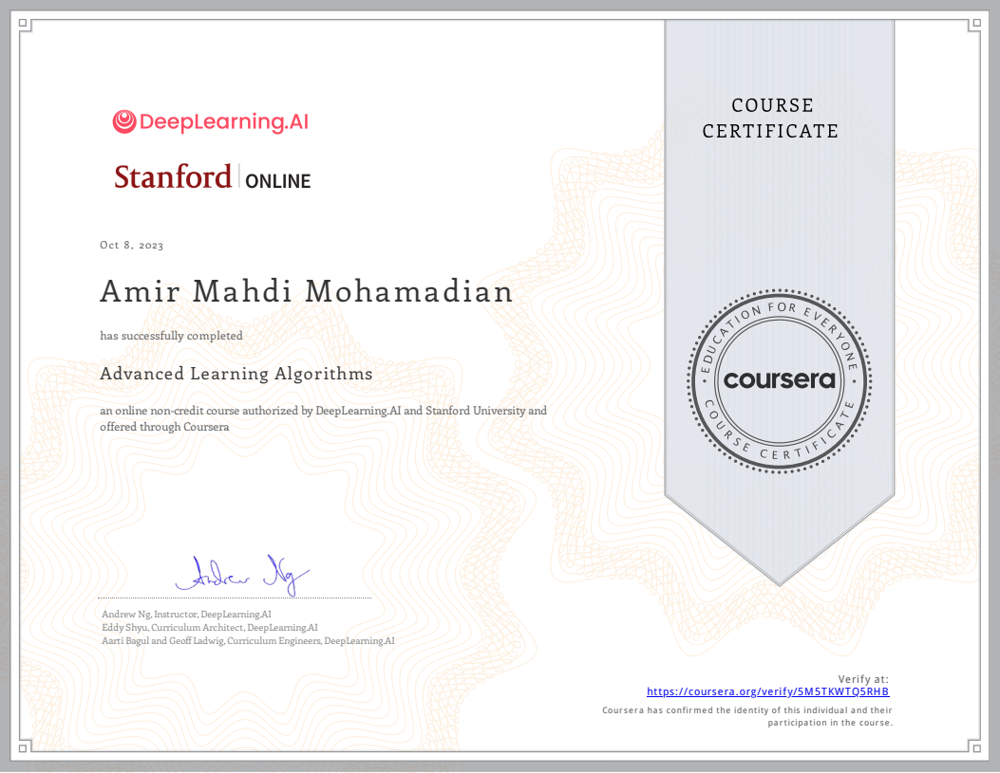

Front-End Engineer, Back-End Developer, UI/UX Designer, Machine Learning Enthusiastic, all in one!

## Who am I?

Hi! I am Amir Mahdi Mohamadian, a dedicated computer engineering student graduated from the University of Tehran, which is ranked as Iran's top university in computer science according to US News [https://www.usnews.com/education/best-global-universities/iran/computer-science].

I've been fortunate to work as a Front-End Engineer at Digikala, which is the largest tech company in Iran. Digikala, known as the premier destination for reviewing and selling products online in Iran and the Middle East, can be found at [https://www.digikala.com/].

Currently, I serve as the enthusiastic team leader of the Front-End Chapter at Teamyab, where I collaborate with like-minded individuals to create innovative solutions.

In addition to that, I'm tirelessly working on my personal projects.

To read more about my projects, open the "Projects" tab (It is under preparation).

	
	<!--  -->

J'apprends le français depuis plus d'un an!

## Undergraduate Thesis Project

I am deeply honored to receive this award for my undergraduate thesis project at the 20th project day in the University of Tehran.

We have worked for almost a year on this project and I was very pleased to see the results and also the reaction of our university’s faculty members to our project and how it solved their problems in managing their research labs.

Our project aims to help any university’s faculty to manage their research labs and supervise their students with ease. Providing beneficial solutions for professors and students needs and problems while working in a research lab.

	
	
	

	
	

## What are my research interests?

- Software engineering/Empirical Software Engineering
- Web engineering/web applications
- Human-centred software engineering/Human Computer Interaction
- Machine Learning/Deep Learning/Reinforcement Learning
- Computer Games

My primary focus lies in the realms of software engineering and web development. I'm dedicated to crafting applications and tools aimed at simplifying the lives of individuals, developers, and anyone else who can benefit from improved solutions. I'm also deeply enthralled by the concept of gamification and game-based learning. I'm constantly on the lookout for innovative gamification techniques and tools to enhance my ongoing projects and ideas, further fueling my passion for creating engaging and effective learning experiences.

## What are my other interests?

Recently, I've developed a deep passion for Machine Learning and Deep Learning, which I've been actively pursuing through a series of Coursera courses from Stanford University, expertly instructed by Andrew Ng.

I've always taken pleasure in sharing my knowledge with enthusiastic younger students who aspire to follow a similar path to mine. Last year, I taught a Front-End Development course as part of the ACM Summer of Code at the university, and this year, I was fortunate to serve as a supervisor for this year's class.

## Contact

Feel free to contact me if you are interested in working with me or have any questions about me or my projects.

<!-- ## Blog

<ul>
	
	<li>
		<b>{{ post.date | date: "%B %e, %Y" }}</b>: <a href="{{ post.url }}">{{ post.title }}</a>
	</li>
	
</ul>

 -->
